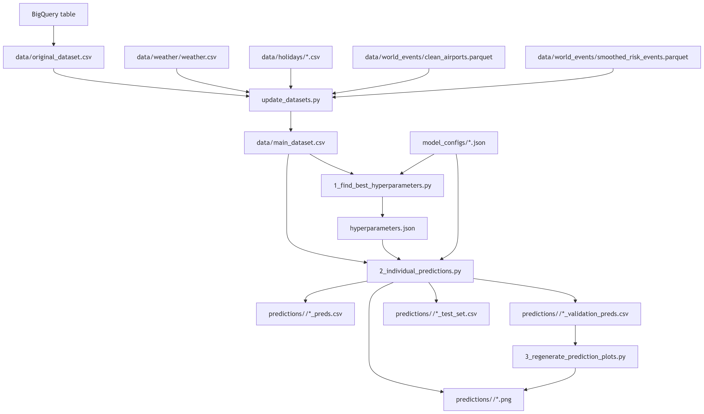

# Master Minds Challenge

This repository contains a tabular machine-learning pipeline for airport movement prediction.

## Participants

- Lancelot TARIOT CAMILLE
- Romain POIRRIER
- Maïa JOUENNE
- Sang NGUYEN

At a high level, the project:

1. downloads a raw movement dataset from BigQuery,
2. rebuilds a richer modeling dataset from it,
3. searches hyperparameters for several regressors,
4. trains models and exports predictions, validation files, test files, and plots.

The most important convention in the project is this:

- `data/original_dataset.csv` is the raw local snapshot,
- `data/main_dataset.csv` is the derived dataset used for modeling.

`original_dataset.csv` is the file the pipeline checks for when deciding whether it needs to download data.  
`main_dataset.csv` is safe to regenerate.

## Table Of Contents

- [Pipeline](#pipeline)
- [How To Run](#how-to-run)
- [What Each Script Does](#what-each-script-does)
- [Targets](#targets)
- [Feature Families](#feature-families)
- [Main Files And Folders](#main-files-and-folders)
- [Models](#models)
- [What You May Want To Change](#what-you-may-want-to-change)
- [Environment](#environment)
- [Practical Note](#practical-note)

## Pipeline



## How To Run

Use Python 3.13.

Install dependencies:

```bash
python -m pip install -r requirements.txt
```

Then run the pipeline in this order:

```bash
python update_datasets.py
python 1_find_best_hyperparameters.py
python 2_individual_predictions.py
```

If you only want to regenerate plots from existing validation prediction files:

```bash
python 3_regenerate_prediction_plots.py
```

## What Each Script Does

[`update_datasets.py`](./update_datasets.py)

This script is the dataset builder. It:

- downloads `data/original_dataset.csv` if it is missing,
- loads external reference data,
- adds weather, holiday, route, world-event, and engineered features,
- writes the result to `data/main_dataset.csv`.

[`1_find_best_hyperparameters.py`](./1_find_best_hyperparameters.py)

This script loads `main_dataset.csv`, prepares the training data, and runs Bayesian hyperparameter search.

The best results are written to:

- `hyperparameters.json`

[`2_individual_predictions.py`](./2_individual_predictions.py)

This script loads the dataset and tuned hyperparameters, trains the enabled models, and writes prediction artifacts.

It can write:

- full prediction files,
- validation-only subsets,
- compact test-set files,
- validation plots.

[`3_regenerate_prediction_plots.py`](./3_regenerate_prediction_plots.py)

This script rebuilds plot images from saved validation prediction CSV files.

## Targets

The pipeline predicts two targets.

### `NbPaxTotal`

Main passenger-count target.

### `PMR`

Secondary target derived from:

- `OzionPHMRPaxArrival`
- `OzionPHMRPaxDeparture`

The value is chosen according to movement direction, with a fallback for anomalous rows.

## Feature Families

The derived dataset includes several feature groups.

### Weather

- `precipitation_sum`
- `rain_sum`
- `snowfall_sum`
- `windspeed_10m_max`

### Route And Geography

- `origin_country`
- `dest_country`
- `is_domestic`
- `is_route_domestic`
- `has_stopover`
- `flight_distance_km`

### Calendar And Holidays

- `day_of_week`
- `is_weekend`
- `season`
- `is_fr_public_holiday`
- `is_bridge_day`
- `is_fr_school_holiday_zone_a`
- `is_fr_school_holiday_zone_b`
- `is_fr_school_holiday_zone_c`
- `is_first_last_day_of_school_holiday`
- `is_origin_public_holiday`
- `is_origin_school_holiday`
- `is_dest_public_holiday`
- `is_dest_school_holiday`
- `is_any_day_off`
- `days_until_next_day_off`
- `days_until_next_workday`

### World Events

- `risk_score`
- `nbDaysSinceRiskStarted`
- `nbDaysSinceSafeStarted`

### Time Encoding

- `month_of_year`
- `hour_of_day`
- `hour_sin`
- `hour_cos`
- `day_of_week_sin`
- `day_of_week_cos`
- `month_sin`
- `month_cos`

### Passenger History

- `pax_lag_1`
- `pax_lag_7`
- `pax_lag_30`
- `pax_rolling_7`
- `pax_ewm_7`
- `pax_diff_1`
- `pax_diff_7`

## Main Files And Folders

[`pipeline_config.py`](./pipeline_config.py)

Shared project configuration:

- dataset paths,
- model paths,
- common column names,
- reference values,
- feature-group names.

[`movement_model_utils.py`](./movement_model_utils.py)

Shared modeling utilities:

- dataset loading,
- target derivation,
- train/validation splitting,
- model pipeline construction,
- prediction export,
- plotting.

[`utils.py`](./utils.py)

General-purpose helpers that are reused across the project.

[`model_configs`](./model_configs)

Model-facing JSON configuration for:

- feature selection,
- row filters,
- prediction overrides.

[`predictions`](./predictions)

Prediction outputs and generated plots.

[`data`](./data)

Main working data folder.

The most important files inside it are:

- `data/original_dataset.csv`
- `data/main_dataset.csv`
- `data/weather/weather.csv`
- `data/world_events/clean_airports.parquet`
- `data/world_events/smoothed_risk_events.parquet`

## Models

The hyperparameter search currently includes:

- `XGBRegressor`
- `HistGradientBoostingRegressor`
- `LGBMRegressor`

The prediction script can instantiate those same models when matching entries are present in `hyperparameters.json`.

## What You May Want To Change

If you want to change train, validation, or test windows:

- edit [`2_individual_predictions.py`](./2_individual_predictions.py)

If you want to change hyperparameter-search limits:

- edit [`1_find_best_hyperparameters.py`](./1_find_best_hyperparameters.py)

If you want to change feature selection or prediction overrides:

- edit files in [`model_configs`](./model_configs)

If you want to rebuild the modeling dataset from the raw snapshot:

- run `python update_datasets.py`

## Environment

The project expects:

- Python 3.13,
- packages from `requirements.txt`,
- BigQuery access for the raw dataset download,
- holiday and world-event reference data under `data/`.

For the BigQuery download step, the code expects:

- `PROJECT_ID`
- `DATASET_ID`
- `TABLE_ID`

It also supports:

- `SERVICE_ACCOUNT_KEY_PATH`
- `YOUR_SERVICE_ACCOUNT_KEY_PATH`

## Practical Note

If results look stale or inconsistent, the usual reset is simple:

1. keep `data/original_dataset.csv` if you want to preserve the raw snapshot,
2. delete `data/main_dataset.csv`,
3. rerun `python update_datasets.py`,
4. rerun tuning or predictions if needed.
